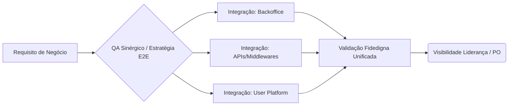

# System Quality Framework 🎯

> **Engenharia de Qualidade, Estratégia de Testes e Validação Sistêmica End-to-End.**

Este repositório é o meu portfólio público de Engenharia de Qualidade. Ele concentra frameworks, estratégias e padrões de arquitetura de testes elaborados para otimizar a garantia de qualidade em sistemas distribuídos (microserviços e cross-squads).

---

## 🚀 Conteúdo em Destaque

| Tópico | Estratégia | Nível | Link |
| :--- | :--- | :--- | :--- |
| **Sinergia E2E** | Quebrando silos e otimizando Job Rotation | 🏆 Principal | [Acessar Artigo](docs/strategies/cross-squad-synergy.md) |
| **Governânça** | Gestão de Bugs e Dono do Fluxo | ⚙️ Processo | [Ver Detalhes](docs/strategies/cross-squad-synergy.md#governança-e-a-fila-de-correção-dono-do-bug) |
| **Segurança** | Compliance em Ambientes Públicos | 🔒 Segurança | [Ler Diretrizes](PUBLICATION-GUIDELINES.md) |

---

## 💡 Por que ler este framework?

Este material resolve dores reais de engenharia de software moderna:
- ⚡ **Redução de Gargalos:** Como evitar que o QA vire o "Super Herói" e trave a entrega.
- 🎯 **Foco no Resultado:** Detecção técnica separada de priorização de negócio.
- 🤝 **Sinergia Real:** A transição do QA de "testador de tela" para "estrategista de produto".

---

## 📚 Arquitetura de Qualidade

---

## 🛠️ Princípios Fundamentais

1. **Qualidade não fica limitada à tela.** O foco está no comportamento do fluxo completo, desde a lógica no banco de dados até a conversão no frontend do cliente.
2. **Especialização com visão sistêmica.** Especialização no domínio de uma squad específica garante profundidade; atuar *cross-squads* (multi-skill) garante eficiência de entrega.
3. **Escalando o Processo.** O papel de QA vai além de achar falhas: atuamos separando a **detecção** (técnica) da **priorização** (negócio/produto).

---

## 🗺️ Visão Macro de Fluxo E2E

Abaixo, a representação simplificada de como orquestramos o fluxo integrado na perspectiva de validação sistêmica:

---

## 🔒 Diretrizes de Segurança Pública

A transparência de processos arquiteturais é crucial, porém a Segurança da Informação do produto é a prioridade zero. 

Este repositório segue rígidas normas de *Data Masking*. Para entender minha política de governança ao tornar processos públicos (compliance, omissão de PI e arquitetura sanitizada), consulte nosso documento padrão:
👉 **[PUBLICATION-GUIDELINES.md](PUBLICATION-GUIDELINES.md)**
