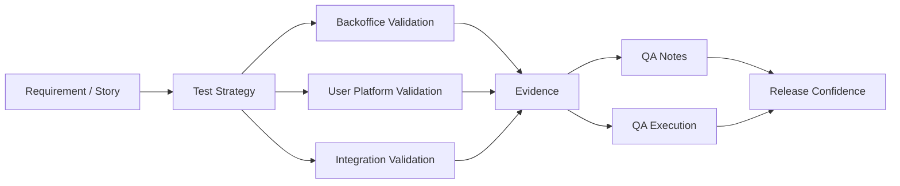

# System Quality Framework

Framework público para documentação de qualidade, estratégia de testes, validação end-to-end e pensamento sistêmico aplicado a produtos digitais.

> Este repositório foi estruturado para funcionar como base profissional de GitHub, com foco em documentação pública, autoridade técnica e organização escalável.

---

## Overview

Este projeto centraliza uma abordagem prática para:

- estruturar QA Notes e QA Execução em BDD
- documentar fluxos end-to-end com visão sistêmica
- registrar regras de negócio e riscos críticos
- organizar cenários reutilizáveis para web, backoffice e integrações
- publicar documentação técnica sem expor dados sensíveis, código proprietário ou contexto confidencial

A proposta é simples: transformar trabalho operacional de QA em material estratégico, legível e reaproveitável.

---

## Repository Goals

Este repositório foi pensado para cumprir quatro funções:

1. **Portfólio técnico**
   Mostrar profundidade de raciocínio, organização e capacidade de estruturar qualidade além da execução manual.

2. **Base documental**
   Concentrar templates, métodos, padrões e exemplos públicos.

3. **Material de referência**
   Facilitar reutilização em estudos, entrevistas, apresentações e publicações.

4. **Autoridade profissional**
   Posicionar o perfil como alguém que entende fluxo, risco, integração, regra de negócio e impacto sistêmico.

---

## Core Principles

### 1. QA orientado a fluxo
Qualidade não deve ficar limitada a tela, campo ou endpoint isolado. O foco está no comportamento do fluxo completo.

### 2. Especialização com visão sistêmica
Profundidade técnica em uma parte do sistema é importante, mas o diferencial está em entender como as peças se conectam.

### 3. Documentação como ativo
Boas execuções se perdem. Boa documentação escala.

### 4. Público não é sinônimo de exposto
Documentação pública deve ser útil sem revelar cliente, sistema real, domínio, credenciais, dados pessoais ou lógica comercial sensível.

---

## Suggested Public Structure

```text
/docs
  /templates
  /strategies
  /flows
  /architecture

/examples
/diagrams
README.md
PUBLICATION-GUIDELINES.md
```

---

## Recommended Content

### Documentation
- QA Notes
- QA Execução
- critérios de aceite traduzidos em cenários
- mapeamento de risco
- comportamento esperado por fluxo
- regras de negócio relevantes

### Strategy
- abordagem de cobertura
- validação cross-system
- análise de impacto
- cenários positivos, negativos e de borda
- idempotência, fallback, permissão, consistência e rastreabilidade

### Examples
- exemplos genéricos de BDD
- exemplos de cenários E2E
- modelos reutilizáveis para task, bugfix, story fix e integração

---

## Recommended Positioning

A mensagem que este repositório transmite não é apenas:

> “eu testo sistema”

A mensagem correta é:

> “eu estruturo qualidade com visão de produto, fluxo, risco e comportamento sistêmico”

Esse enquadramento é mais forte para recrutadores, liderança, produto e engenharia.

---

## Safe Publication Rules

Antes de publicar qualquer conteúdo, valide se removeu:

- nomes reais de empresa
- nomes reais de sistemas
- URLs reais de ambiente
- tokens, ids internos e credenciais
- CPF, telefone, e-mail ou dados de usuário
- imagens com dados sensíveis
- detalhes que revelem lógica comercial protegida

Use nomes genéricos como:

- `Backoffice System`
- `User Platform`
- `Core Platform`
- `Admin Portal`
- `External Provider`
- `CRM Provider`

---

## Files Included in This Base

### `docs/framework-overview.md`
Visão macro do framework e do racional técnico.

### `PUBLICATION-GUIDELINES.md`
Regras objetivas para publicar com segurança.

### `docs/templates/qa-notes-template.md`
Template base de QA Notes em português.

### `docs/templates/qa-execution-template.md`
Template base de QA Execução em português.

### `docs/templates/bdd-scenarios-template.md`
Modelo de cenários BDD genéricos.

### `docs/templates/linkedin-post-template.md`
Estrutura curta para divulgar documentação sem criar post gigante.

---

## Diagram

Abaixo, um fluxo genérico para representar validação sistêmica:



---

## How To Use This Repository

1. Publique este repositório como sua base pública.
2. Adapte o texto do README para seu posicionamento.
3. Use os templates para transformar execuções reais em documentação pública.
4. Crie novos arquivos em `docs/flows` e `docs/strategies` conforme evoluir seu conteúdo.
5. Mantenha projetos comercializáveis e código proprietário em repositórios privados.

---

## Suggested Next Repositories

Depois deste repositório base, a evolução natural é:

### Public
- `system-quality-framework`
- `qa-strategy-notes`
- `frontend-showcase`
- `pwa-architecture-notes`

### Private
- PWAs em produção
- SaaS próprio
- código vendável
- projetos com cliente

---

## LinkedIn / External Sharing

Estratégia recomendada:

- fazer um post curto
- chamar atenção para o raciocínio e não para volume de texto
- direcionar quem tiver interesse para este repositório ou para um documento específico

Exemplo de chamada:

> Tenho estruturado minha atuação em QA com foco em fluxo end-to-end, documentação reutilizável e visão sistêmica. Para não transformar isso em um post enorme, organizei o material em um repositório público. Quem tiver interesse, pode explorar sem compromisso.

---

## Final Note

Este repositório não precisa nascer gigante. Ele precisa nascer consistente.

Clareza, estrutura e recorrência valem mais do que volume.

---

## License

Você pode manter este repositório sem licença pública específica ou adicionar uma licença depois, conforme sua estratégia.
