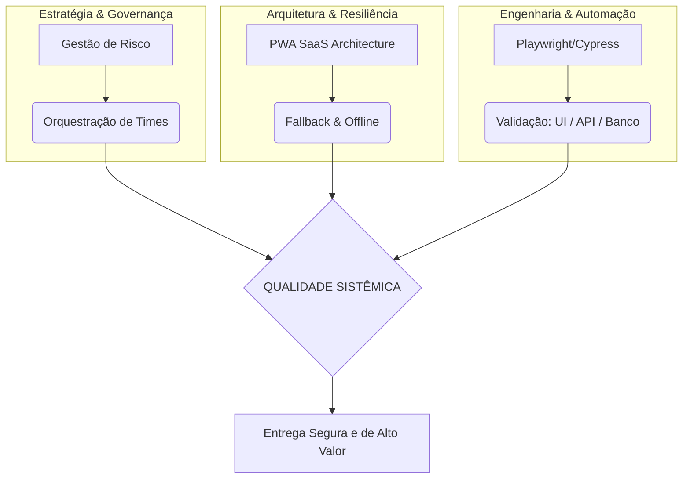

# System Quality Framework (SQF) 🎯

> **Estratégia, Governança e Automação de Alta Performance.**

Este repositório reúne o meu framework pessoal de Engenharia de Qualidade. Ele foi construído para resolver problemas que vivi na prática, como a falta de comunicação entre times (silos), riscos em grandes lançamentos corporativos e a necessidade de automações que sejam realmente confiáveis.

Aqui, o foco não é apenas "encontrar falhas", mas garantir que o processo de entrega seja eficiente do início ao fim.

---

## 🏗️ Os 3 Pilares do Framework

O framework é organizado em três camadas fundamentais para garantir a qualidade sistêmica:

### 1. Orquestração de Qualidade (Technical Leadership)
Como liderar a qualidade sistêmica e gerenciar riscos em ambientes complexos.
- **[Sinergia Cross-Squad (E2E)](docs/strategies/cross-squad-synergy.md):** Focado em orquestrar a colaboração entre diferentes silos técnicos.
- **[Governança e Mitigação de Risco](docs/strategies/enterprise-governance.md):** Gestão de parceiros, War Rooms e criticidade de prazos.
- **[Narrativa de Testes (QA Notes & BDD)](docs/strategies/test-narrative-bdd.md):** Documentação técnica que serve de ponte entre o negócio e a engenharia.
- **[Assets: Templates de Liderança](examples/templates/):** Checklists de prontidão e Matrizes de Risco.

### 2. Arquitetura & Resiliência
Construindo softwares que suportam falhas e garantem uma boa experiência.
- **[Blueprint: SaaS PWA Architecture](examples/pwa-saas-architecture/):** Resiliência offline e consistência de dados.

### 3. Engenharia de Automação (Execução Técnica)
Automação robusta para Web, Mobile e Banco de Dados.
- **Web/E2E:** [Cypress High Reliability Patterns](examples/cypress-high-reliability-patterns/)
- **Mobile/Performance:** [Playwright Mobile Performance](examples/mobile-playwright-patterns/)
- **Database Audit:** [Database Validation Patterns (SQL/HeidiSQL)](examples/database-validation-patterns/)

---

## 🗺️ Visão Unificada do Processo

Este diagrama ilustra como os pilares se conectam para entregar valor:

---

## 🔒 Governança e Segurança
Toda a documentação e exemplos deste framework seguem diretrizes rigorosas de **Data Masking e Compliance**, garantindo que nenhum dado real ou sensível seja exposto (Sanitização E2E).

---

## 🛠️ Stack Tecnológica
**QA & Automação:** Cypress, Playwright (Web & Mobile), Appium, Jest.  
**Frontend & PWA:** React, Service Workers, Cache API.  
**Backend & Database:** Node.js, REST APIs, **SQL Server / MySQL**.  
**Cloud & DevOps:** **Azure DevOps**, GitHub Actions.

---
[LICENSE](LICENSE) | Copyright © 2026 Kássio Rocha
