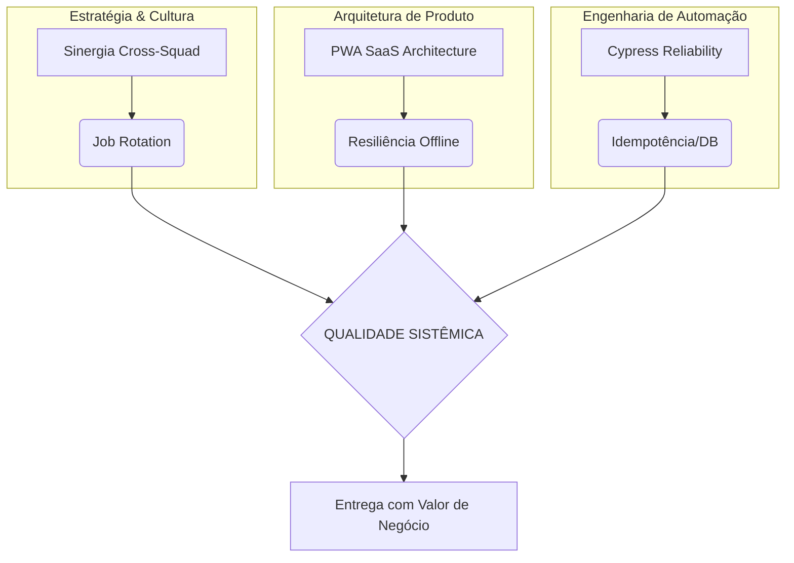

# System Quality Framework 🎯

> **Engenharia de Qualidade, Estratégia de Testes e Validação Sistêmica End-to-End.**

Este repositório consolida meu framework pessoal de Engenharia de Qualidade, fundamentado na resolução de silos operacionais e na construção de softwares resilientes. O objetivo aqui não é apenas "testar", mas garantir a **Eficiência Sistêmica** em ciclos de entrega modernos.

---

## 🏗️ Os 3 Pilares do Framework

O framework é dividido em três camadas complementares que garantem a qualidade desde a estratégia até a execução técnica:

### 1. Estratégia & Cultura (Quality Mindset)
Focado em quebrar silos entre squads e otimizar o capital humano através da sinergia.
- **Destaque:** [Estratégia de Sinergia Cross-Squad (E2E)](docs/strategies/cross-squad-synergy.md)
- **Problema resolvido:** O gargalo do "QA Super-Herói" e a demora no onboarding.

### 2. Arquitetura de Produto (PWA SaaS)
Focado na construção de aplicações que suportam falhas e garantem a melhor experiência de usuário.
- **Destaque:** [Blueprint: SaaS PWA Multi-App Architecture](examples/pwa-saas-architecture/)
- **Problema resolvido:** Instabilidade offline e inconsistência de cache em PWAs complexos.

### 3. Engenharia de Automação (High Reliability)
Focado na criação de suítes de testes que não falham por instabilidade de ambiente ou DOM.
- **Destaque:** [Blueprint: Cypress High Reliability Patterns](examples/cypress-high-reliability-patterns/)
- **Problema resolvido:** Intermitência (flakiness) em testes E2E e dependência de massa manual.

---

## 🗺️ Visão Sistêmica Unificada

Este diagrama representa como os 3 pilares se integram na minha metodologia de trabalho:

---

## 🔒 Governança e Segurança

A transparência técnica é acompanhada de rigorosa proteção de dados. Sigo diretrizes estritas de *Data Masking* e *Compliance* para garantir que nenhum dado sensível ou comercial seja exposto neste portfólio.
- 👉 **[Consulte as Diretrizes de Publicação](PUBLICATION-GUIDELINES.md)**

---

## 🛠️ Tecnologias e Ferramentas Cobertas
**QA & Testing:** Cypress, Playwright, Appium, Jest.  
**Frontend & PWA:** React, PWA (Service Workers, Cache API, Manifest), HTML5/CSS3.  
**Backend & Cloud:** Firebase (Firestore/Auth/Hosting), Node.js, REST APIs.  
**Cultura:** Agile, Cross-Squad Synergy, Continuous Testing (CI/CD).

---
[LICENSE](LICENSE) | Copyright © 2026 Kassio Rocha
