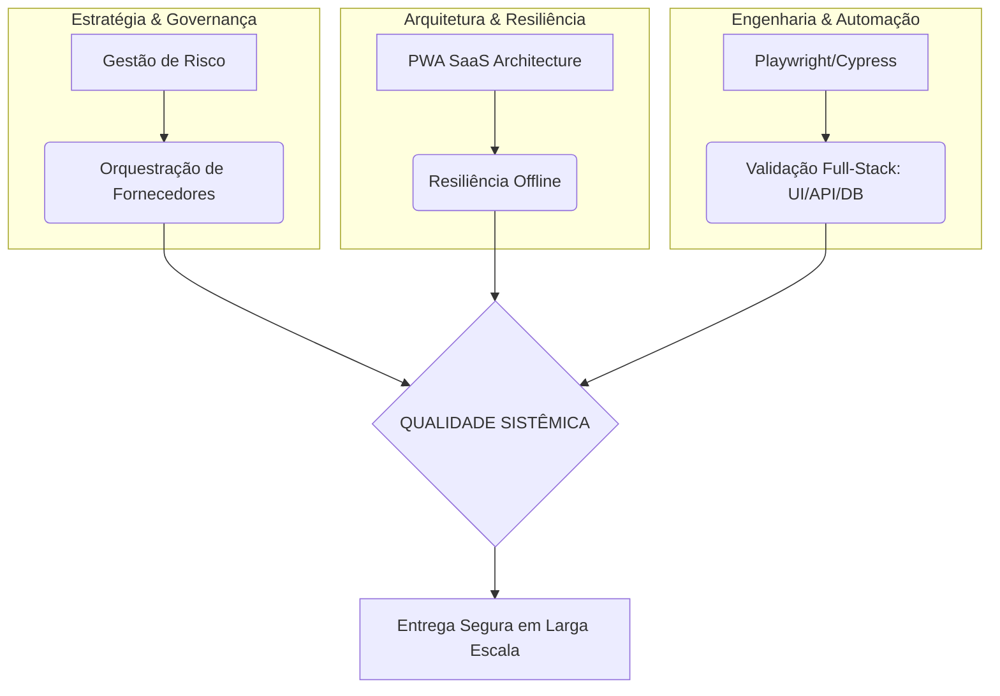

# System Quality Framework 🎯

> **Engenharia de Qualidade Sistêmica, Governança Corporativa e Automação de Alta Performance.**

Este repositório consolida meu framework pessoal de Engenharia de Qualidade, fundamentado na resolução de silos operacionais, mitigação de riscos em ambientes Tier 1 (Telecom/Banking) e na construção de softwares resilientes.

---

## 🏗️ Os 3 Pilares do Framework

O framework garante a qualidade desde a alta gestão estratégica até a execução técnica de ponta:

### 1. Estratégia & Governança (Quality Leadership)
Focado em quebrar silos e gerenciar riscos em ambientes corporativos de larga escala.
- **Destaque 1:** [Sinergia Cross-Squad (E2E)](docs/strategies/cross-squad-synergy.md) - Otimização de times.
- **Destaque 2:** [Governança Corporativa e Risco](docs/strategies/enterprise-governance.md) - Gestão de fornecedores e War Rooms.
- **Destaque 3:** [Narrativa de Testes (QA Notes & BDD)](docs/strategies/test-narrative-bdd.md) - Documentação técnica de alto nível.

### 2. Arquitetura de Produto (Resiliência)
Focado na construção de aplicações que suportam falhas e garantem a melhor experiência de usuário.
- **Destaque:** [Blueprint: SaaS PWA Architecture](examples/pwa-saas-architecture/)
- **Problema resolvido:** Instabilidade offline e inconsistência de dados em redes instáveis.

### 3. Engenharia de Automação (High Reliability)
Suítes de testes resilientes para Web, Mobile e integrações de Banco de Dados.
- **Web/E2E:** [Cypress High Reliability Patterns](examples/cypress-high-reliability-patterns/)
- **Mobile Mobile:** [Playwright Mobile Performance](examples/mobile-playwright-patterns/)
- **Database:** Validação profunda de persistência via **HeidiSQL/SQL Scripts**.

---

## 🗺️ Visão Sistêmica Unificada

---

## 💼 Carreira e Consultoria
Além da técnica, foco no posicionamento estratégico do QA como parceiro de negócio.
- 👉 **[Guia de Upgrade de Carreira (LinkedIn Sênior)](docs/career/linkedin-revamp.md)**

---

## 🔒 Governança e Segurança
Este repositório segue rígidas normas de *Data Masking* e *Compliance*.
- 👉 **[Consulte as Diretrizes de Publicação](PUBLICATION-GUIDELINES.md)**

---

## 🛠️ Tecnologias e Ferramentas
**QA & Testing:** Cypress, Playwright (Web & Mobile), Appium, Jest.  
**Frontend & PWA:** React, PWA Service Workers, Cache API.  
**Backend & Database:** Node.js, REST APIs, **HeidiSQL / SQL Server / MySQL**.  
**DevOps & Cloud:** **Azure DevOps (Boards, Test Plans, Analytics)**, GitHub Actions.

---
[LICENSE](LICENSE) | Copyright © 2026 Kássio Rocha
