⬅️ [Voltar para o Início](../../README.md) | 📄 [Continuação: Sinergia de Cenários](./scenario-synergy.md)

# Estratégia de Qualidade: Sinergia entre Squads

**Conceito:**
> "A qualidade sistêmica é garantida quando olhamos para a jornada completa do usuário, não apenas para as tarefas isoladas de cada time."

Este documento descreve como otimizar a garantia de qualidade em ambientes onde diferentes equipes (squads) precisam entregar uma jornada única para o cliente. O foco é eliminar os "silos" de conhecimento e garantir que o software funcione perfeitamente de ponta a ponta.

---

## 📈 Diagrama de Fluxo: Silos vs Sinergia

Este diagrama ilustra a diferença entre a atuação isolada (Silos) e a orquestração ponta a ponta (Sinergia):

```mermaid
graph TD
    subgraph SquadC ["Squad C"]
        QA_C[QA User Platform] -->|Valido UI| Interface[Interface]
    end

    subgraph Synergy ["Abordagem Sinérgica E2E"]
        QA_Multi[QA Multi-Skill E2E]
    end

    subgraph SquadB ["Squad B"]
        QA_B[QA Core] -->|Valida API| API[API]
    end

    subgraph SquadA ["Squad A"]
        QA_Back[QA Backoffice] -->|Setup| Massa[Massa]
    end

    %% Conexões da Sinergia
    QA_Multi --> Interface
    QA_Multi --> API
    QA_Multi -->|Domina o Fluxo| Massa

    style Synergy fill:#2d2d2d,stroke:#555,stroke-width:2px
    style QA_Multi fill:#1a1a1a,stroke:#888,color:#fff
```

---

## 🚀 Os Desafios dos Silos de Conhecimento

Em estruturas de squads, é comum que cada QA se torne um especialista profundo apenas no seu módulo. Isso gera riscos:
- **Testes Fragmentados:** Squad A e Squad B testam suas partes, mas a integração entre elas falha.
- **Dificuldade de Onboarding:** Se um QA sai ou fica doente, a squad fica "cega" tecnicamente.
- **Gargalos de Entrega:** Falta de braço técnico em momentos de pico em squads específicas.

---

## 🤝 A Solução: Sinergia e Colaboração Técnica

Minha abordagem propõe que o QA tenha uma visão sistêmica e atue além das fronteiras do seu time:

### 1. Colaboração entre Squads (Job Rotation)
Estimular que membros de uma squad conheçam as integrações das squads vizinhas. 
- **Benefício:** Redução drástica no tempo de entendimento de bugs que envolvem múltiplos sistemas.
- **Resiliência:** O time de QA se torna intercambiável, suportando picos de demanda em diferentes frentes.

### 2. Validação Fidedigna (Ambientes Integrados)
Trabalhar para que os ambientes de teste reflitam a realidade da produção em termos de dados e integrações.
- **Cenários Reais:** Testar o fluxo completo, desde a origem da informação até o impacto final no cliente.

### 3. Governança e Rastreabilidade do Erro
A função do QA sênior é identificar **quem** deve corrigir o problema e fornecer os dados para isso.
- **Dono do Bug:** Se um bug é encontrado na integração, o QA sinérgico identifica a origem exata (Backend, API ou Frontend) e direciona para a equipe correta com todas as evidências.

---

## 🏆 Benefícios para o Negócio

1. **Redução de Regressão:** Erros de integração são pegos muito antes de chegarem ao cliente.
2. **Onboarding Acelerado:** Documentação clara e processos compartilhados facilitam a entrada de novos membros.
3. **Visibilidade para a Gestão:** Relatórios que mostram a saúde do ecossistema completo, não apenas de um pedaço do código.

---
⬅️ [Voltar para o Início](../../README.md) | ➡️ [Próximo: Sinergia de Cenários](./scenario-synergy.md)