⬅️ [Voltar para o Início](../../README.md) | 📄 [Estratégia Cross-Squad Sinérgico](./cross-squad-synergy.md)

# Sinergia de Cenários sob Pressão

> "Não basta ter tempo para testar. É preciso saber onde o tempo vale mais."

Em sistemas de alta criticidade, o QA frequentemente precisa atuar com uma janela de testes menor do que o esforço necessário — mantendo ainda a responsabilidade sobre a segurança do deploy.

Isso não é exceção. É o cenário real.

Este documento descreve como aplicar **Sinergia de Cenários** nessas situações: eliminando duplicidade de esforço, negociando priorização com consciência de risco e executando com inteligência sistêmica.

É a aplicação prática da mentalidade Cross-Squad Sinérgica — não entre squads, mas **dentro da própria execução dos testes**.

---

## O Problema

Cenário típico:

- Escopo elevado
- Prazo fixo (não negociável)
- Janela de testes menor que a cobertura completa

Nessas condições, abordagens tradicionais se tornam ineficientes:

- Testar fluxos de forma isolada
- Repetir setup várias vezes para cada funcionalidade
- Gastar tempo em cenários de baixo impacto

Resultado: o tempo acaba antes da validação dos fluxos críticos.

---

## O Desafio Real

O desafio não é testar tudo.

O desafio é:

> **o que testar, como testar e em qual ordem — sob pressão**

O QA estratégico faz a pergunta certa antes de começar:

> *"O tempo disponível é suficiente para cobrir tudo com a qualidade necessária?"*

Se a resposta for não — e frequentemente é — entra em cena a **estratégia de sinergia e negociação**.

---

## Diagrama: Execução Reativa vs Execução Estratégica

```mermaid
graph TD
    subgraph Reativo ["❌ Abordagem Reativa"]
        R1[Recebe a task] --> R2[Abre o ambiente]
        R2 --> R3[Executa cenário por cenário]
        R3 --> R4[Descobre que não há tempo]
        R4 --> R5[Entrega parcial sem visibilidade]
    end

    subgraph Estrategico ["✅ Abordagem Estratégica"]
        E1[Recebe a task] --> E2[Analisa PR + mapeia escopo]
        E2 --> E3[Estima esforço real]
        E3 --> E4{Janela disponível >= Esforço total?}
        E4 -->|Sim| E5[Executa com sinergia de cenários]
        E4 -->|Não| E6[Negocia priorização com PO e DEV]
        E6 --> E7[Lista de Prioridade 0 definida]
        E7 --> E5
        E5 --> E8[War Room — correções em tempo real]
        E8 --> E9[Deploy + Validação em Produção]
    end

    style Estrategico fill:#1a2a1a,stroke:#3a7a3a,stroke-width:2px
    style Reativo fill:#2a1a1a,stroke:#7a3a3a,stroke-width:2px
    style E4 fill:#1a1a2a,stroke:#5555aa,color:#fff
```



---

## Estratégia Aplicada

Para lidar com esse cenário, a abordagem precisa sair da execução e ir para a estratégia.

### Fase 1 — Análise antes da execução

Antes de testar qualquer coisa, construa uma visão completa do que está sendo entregue:

- **Revisão do Pull Request:** entender o que mudou no código, não apenas o que está descrito no card
- **QA Notes:** registro dos pontos de atenção, riscos e dependências identificados na análise
- **QA Execução:** mapeamento dos cenários possíveis dentro do escopo levantado
- **Estimativa de esforço:** calcular o tempo real necessário para cobrir o escopo com qualidade

> ⚠️ Se a janela disponível for menor que o esforço estimado, comunique isso imediatamente — antes de executar qualquer cenário.

---

### Fase 2 — Negociação de priorização

Com o gap identificado, a postura correta é provocar uma decisão consciente do time — não absorver o risco silenciosamente.

Como conduzir a negociação:

1. **Apresentar os números:** *"Para cobrir o escopo completo, preciso de X horas. Tenho Y disponíveis."*
2. **Propor a divisão em prioridades:** o que é impeditivo para o rollout? O que é diferencial, mas não bloqueante?
3. **Formalizar a Prioridade 0:** junto ao PO e ao DEV, listar o que não pode ir para produção com bug
4. **Documentar a decisão:** o risco do escopo não coberto deve ser visível para a liderança

| Prioridade | Critério | Exemplo |
|---|---|---|
| **P0 — Bloqueador** | Impede o rollout ou gera impacto direto ao usuário final | Fluxo de pagamento, autenticação, cálculo regulatório |
| **P1 — Crítico** | Alto impacto, mas possui contorno ou fallback | Notificações, relatórios administrativos |
| **P2 — Relevante** | Melhoria ou funcionalidade secundária | Ajustes de UI, mensagens de erro não críticas |

> O QA que levanta a bandeira antes de executar protege o time. O que só executa, descobre o problema tarde demais.

---

### Fase 3 — Sinergia de Cenários

Com as prioridades definidas, os cenários deixam de ser sequenciais e passam a ser **sistêmicos**.

Ao invés de testar funcionalidades separadas, os testes são estruturados para refletir o comportamento real do sistema. Uma única execução valida múltiplas camadas ao mesmo tempo.

**Exemplo:**

```
Massa A → cobre um grupo sinérgico de validações:
  ✅ Cadastro do usuário
  ✅ Login e autenticação
  ✅ Chamada de API + verificação via Swagger
  ✅ Processamento assíncrono (cron/jobs)
  ✅ Disparo e recebimento de e-mail transacional
  ✅ Crédito e saldo na Wallet

Massa B → cobre um segundo grupo sinérgico (status diferente):
  ✅ Edge case de status bloqueado
  ✅ Regra de negócio alternativa
  ✅ Comportamento da API no cenário negativo
```

**Por que funciona:**

- Elimina retrabalho de setup
- Maximiza cobertura por execução
- Foca no comportamento real do sistema (E2E)
- Prioriza fluxos críticos de negócio
- Reduz tempo sem comprometer a segurança

---

### Fase 4 — War Room

Em demandas críticas com prazo fixo, o modelo tradicional de "abre bug → aguarda correção → reagenda teste" é lento demais.

No modelo **War Room**, QA e DEV atuam no mesmo ambiente — presencial ou remoto — com homologação aberta. Cada falha encontrada é corrigida em tempo real, sem fila e sem novo ciclo de sprint.

- Bugs corrigidos no mesmo ciclo de execução
- Tempo de resolução reduzido drasticamente
- Decisões técnicas tomadas com QA presente — sem perda de contexto

---

### Fase 5 — Validação em Produção

O ciclo não termina no deploy.

A validação em ambiente produtivo confirma que o que foi aprovado em homologação subiu corretamente, que nenhuma configuração causou regressão inesperada e que o sistema se comporta conforme esperado para o usuário final.

> Esta etapa fecha o ciclo completo — da análise do PR até a confirmação em produção.

---

## Impacto Real

Em uma demanda mandatória com prazo fixo e janela reduzida:

| Métrica | Resultado |
|---|---|
| **Story Fixes encontrados** | 9 bugs identificados e corrigidos em tempo real |
| **Escopo coberto** | 100% das funcionalidades Prioridade 0 |
| **Rollout** | Liberado dentro da janela mandatória |
| **Validação produtiva** | Confirmada com sucesso |

Isso só foi possível com sinergia de cenários.

---

## Conclusão

Quando o tempo não é um problema, testar tudo é possível.

Quando o tempo é limitado, testar precisa ser estratégico.

> **Qualidade não é testar mais.  
> É testar o que importa, da forma mais inteligente possível.**

Sinergia de cenários não é otimização.

É uma necessidade em sistemas reais.

---

## Conexão com a Estratégia Cross-Squad Sinérgico

Este documento é a continuação direta de **[Cross-Squad Sinérgico](./cross-squad-synergy.md)**.

| Estratégia | Escopo | Princípio |
|---|---|---|
| **Cross-Squad Sinérgico** | Entre squads | Um QA domina o fluxo E2E completo, evitando fragmentação entre times |
| **Sinergia de Cenários** | Dentro da execução | Um conjunto de cenários cobre múltiplas camadas sem duplicidade de esforço |

A mentalidade é a mesma: **enxergar o sistema como um fluxo, não como partes isoladas.**

---

⬅️ [Voltar para o Início](../../README.md) | 📄 [Estratégia Cross-Squad Sinérgico](./cross-squad-synergy.md)
