⬅️ [Voltar para o Início](../../README.md)

# Narrativa de Testes: QA Notes & QA Execução

> "Um teste bem documentado não é burocracia. É a diferença entre um bug encontrado e um bug que vai para produção."

A **Narrativa de Testes** organiza a atuação do QA em dois momentos distintos: o **planejamento antes de testar** e o **registro técnico durante a execução**.

Sem essa separação, o analista entra no ambiente sem contexto, testa sem critério e reporta sem rastreabilidade.

---

## As Duas Fases

### Fase 1 — QA Notes (Planejamento)

Criado **antes de qualquer execução**. O objetivo é consolidar o entendimento da demanda, mapear riscos e preparar a infraestrutura de teste — aplicando o princípio de **Shift-Left**: trazer a qualidade para o início do processo.

Um QA Notes bem escrito responde a seis perguntas antes de o teste começar:

| Campo | Pergunta que responde |
|---|---|
| **Objetivo** | O que estou validando e por que isso importa? |
| **Escopo** | O que entra e o que está fora desta análise? |
| **Regras de Negócio** | Quais são os critérios de aceite e os estados possíveis do sistema? |
| **Dependências** | O que preciso ter pronto para começar? (ambientes, acessos, dados) |
| **Massa de Dados** | Quais dados de teste cobrem cada cenário relevante? |
| **Estratégia de Execução** | Em que ordem e como os testes serão executados? |

> ⚠️ **Diagnóstico Prévio (RCA):** Se uma inconsistência for identificada ainda no planejamento, ela entra no QA Notes com a hipótese de causa raiz. O DEV já sabe por onde investigar antes mesmo do bug ser reportado formalmente. Isso elimina ciclos de ida e volta.

---

### Fase 2 — QA Execução (Evidência Técnica)

Registro auditável do que foi testado. Transforma cada cenário em evidência estruturada, rastreável e legível para qualquer stakeholder — QA, DEV, PO ou Gestão.

Estrutura padrão de cada cenário:

```
Cenário: [Nome descritivo do comportamento testado]

  Dado que [contexto e pré-condição do sistema]
  Quando  [ação executada pelo usuário ou sistema]
  Então   [resultado esperado e verificado]

Evidências:
  - Status HTTP: [código de resposta]
  - Payload: [resumo da resposta da API]
  - DB: [resultado da query de validação]
  - Print/Log: [referência da evidência visual]
```

---

## Diagrama: Fluxo da Task até a Produção

```mermaid
flowchart LR
    A[Task Recebida] --> B[Análise do PR\n+ Documentação]
    B --> C[QA Notes\nPlanejamento]
    C --> D{Janela de teste\nsuficiente?}
    D -->|Sim| E[QA Execução\nCobertura completa]
    D -->|Não| F[Negociação\nde Prioridade]
    F --> G[Sinergia de\nCenários]
    G --> E
    E --> H[Report +\nEvidências]
    H --> I[Validação\nem Produção]

    style C fill:#1a2a3a,stroke:#3a7aaa,stroke-width:2px
    style G fill:#1a2a1a,stroke:#3a7a3a,stroke-width:2px
    style D fill:#2a1a1a,stroke:#7a3a3a,color:#fff
```



---

## Exemplo Aplicado

Para ilustrar a metodologia, considere um sistema fictício de **onboarding de usuários com verificação regulatória** — um padrão comum em plataformas financeiras, fintechs e qualquer produto sujeito a compliance.

### Contexto do Exemplo

Um novo módulo de verificação de usuário é integrado ao fluxo de cadastro e login. O sistema consulta uma API externa e retorna diferentes estados de permissão. O QA precisa validar o comportamento da aplicação para cada estado possível.

---

### QA Notes — Exemplo

**Objetivo**
Validar o comportamento do sistema nos fluxos de Cadastro e Login após integração com API de verificação regulatória. Cobrir todos os estados de permissão retornados e garantir que cada um seja tratado corretamente no frontend, na API e no banco de dados.

**Escopo**
Dentro do escopo:
- Fluxo de cadastro com verificação de documento
- Fluxo de login com checagem de status ativo/bloqueado
- Regras de negócio para cada estado de resposta da API

Fora do escopo:
- Fluxo de recuperação de senha
- Testes de performance e carga

**Regras de Negócio**

| Estado | Comportamento no Cadastro | Comportamento no Login |
|---|---|---|
| **Aprovado** | Cadastro liberado normalmente | Acesso liberado |
| **Pendente** | Cadastro aceito com aviso de análise | Acesso temporário com restricao de funcionalidades |
| **Bloqueado** | Cadastro impedido com mensagem ao usuário | Acesso negado com redirecionamento |
| **Exceção** | Tratado caso a caso por regra de negócio | Acesso condicional definido pela regra vigente |

**Dependências**
- Ambiente de homologação com a nova versão da API integrada
- Massa de dados com documentos que retornam cada estado
- Acesso ao painel de administração para forçar estados sem aguardar processamento automático
- Swagger do serviço de verificação disponível para validação de rotas

**Estratégia de Execução**
Agrupar cenários por estado e validar cada um de ponta a ponta antes de avançar. Priorizar os estados de bloqueio — são os de maior risco para o go-live. Utilizar sinergia de cenários para cobrir múltiplas camadas em cada execução (ver [Sinergia de Cenários](./scenario-synergy.md)).

---

### QA Execução — Exemplo de Cenário

```
Cenário: Impedir cadastro de usuário com status Bloqueado

  Dado que o sistema está integrado com a API de verificação regulatória
  E o documento informado retorna o status "Bloqueado"
  Quando o usuário submete o formulário de cadastro
  Então o sistema deve impedir o cadastro
  E exibir a mensagem de impedimento correspondente ao status
  E não deve criar registro do usuário no banco de dados

Evidências:
  - Status HTTP: 403 Forbidden
  - Payload: { "status": "blocked", "reason": "regulatory_check_failed" }
  - DB: SELECT retorna 0 registros para o documento testado
  - Print: captura do frontend com mensagem de bloqueio visível
```

---

## Validação Full-Stack

A Narrativa de Testes não se limita à interface. Cada cenário é validado em múltiplas camadas:

### Frontend
- Mensagem correta exibida para cada estado
- Redirecionamento adequado após ação bloqueada
- Campos desabilitados ou ocultados conforme regra de negócio

### API e Network
- Status HTTP correto para cada estado
- Payload de resposta com os campos esperados
- Identificação de erros silenciosos — aqueles que não aparecem na tela, mas comprometem o sistema

### Banco de Dados
- Persistência correta do estado após ação do usuário ou processamento automático
- Ausência de registros indevidos em fluxos de bloqueio
- Integridade dos dados após transições de estado

---

## Conexão com Sinergia de Cenários

Este documento descreve **como planejar e documentar** os testes.

O documento **[Sinergia de Cenários sob Pressão](./scenario-synergy.md)** descreve **como executar com inteligência** quando a janela de testes é menor que o escopo.

Os dois se complementam: o QA Notes define o mapa. A Sinergia de Cenários define a rota mais eficiente para percorrê-lo.

---

⬅️ [Voltar para o Início](../../README.md) | 📄 [Sinergia de Cenários sob Pressão](./scenario-synergy.md)
