⬅️ [Voltar para o Início](../../README.md)

# Narrativa de Testes: QA Notes & QA Execução

> "Um teste bem documentado não é burocracia. É a diferença entre um bug encontrado e um bug que vai para produção."

A **Narrativa de Testes** é o workflow operacional que organiza a atuação do QA em dois momentos distintos e complementares: o **planejamento antes de testar** e a **evidência técnica durante a execução**.

Sem essa separação, o analista entra no ambiente sem contexto, testa sem critério e reporta sem rastreabilidade.

---

## As Duas Fases

### Fase 1 — QA Notes (Planejamento e Descoberta)

O QA Notes é criado **antes de qualquer execução**. Seu objetivo é consolidar o entendimento da demanda, mapear riscos e preparar a infraestrutura de teste — aplicando o princípio de **Shift-Left**: trazer a qualidade para o começo do processo, não para o final.

Um QA Notes bem escrito responde a seis perguntas antes de o teste começar:

| Campo | Pergunta que responde |
|---|---|
| **Objetivo** | O que estou validando e por quê isso importa? |
| **Escopo** | O que entra e o que está fora desta análise? |
| **Regras de Negócio** | Quais são os critérios de aceite e os estados possíveis do sistema? |
| **Dependências** | O que preciso ter pronto para começar? (ambientes, acessos, massa) |
| **Massa de Dados** | Quais dados de teste cobrem cada cenário relevante? |
| **Estratégia de Execução** | Em que ordem e de que forma os testes serão executados? |

> ⚠️ Se um risco ou divergência for identificado durante o planejamento, ele entra no QA Notes como **Diagnóstico Prévio (RCA)** — assim o DEV já sabe por onde investigar antes mesmo do bug ser reportado formalmente.

---

### Fase 2 — QA Execução (Evidência Técnica)

O QA Execução é o registro auditável do que foi testado. Ele transforma cada cenário em uma evidência estruturada, rastreável e compreensível para qualquer stakeholder — QA, DEV, PO ou Gestão.

Estrutura de cada cenário:

```
Cenário: [Nome descritivo do comportamento testado]

  Dado que [contexto/pré-condição do sistema]
  Quando  [ação executada pelo usuário ou sistema]
  Então   [resultado esperado verificado]

Evidências:
  - Status HTTP: [código]
  - Payload: [resumo da resposta]
  - DB: [query de validação e resultado]
  - Print/Log: [referência]
```

---

## Diagrama: Quando cada fase entra no processo

```mermaid
flowchart LR
    A[Task Recebida] --> B[Análise do PR\n+ Documentação]
    B --> C[QA Notes\nplanejamento]
    C --> D{Gap de\njanela?}
    D -->|Não| E[QA Execução\ncobertura completa]
    D -->|Sim| F[Negociação\nde Prioridade]
    F --> G[Sinergia de\nCenários]
    G --> E
    E --> H[Report\n+ Evidências]
    H --> I[Validação\nem Produção]

    style C fill:#1a2a3a,stroke:#3a7aaa,stroke-width:2px
    style G fill:#1a2a1a,stroke:#3a7a3a,stroke-width:2px
    style D fill:#2a1a1a,stroke:#7a3a3a,color:#fff
```



---

## Exemplo Real: Integração com API Regulatória Governamental

> 🔒 **Compliance:** Todos os dados de usuário abaixo são fictícios e gerados exclusivamente para o ambiente de homologação. Nenhum CPF, e-mail ou informação pessoal real é utilizado neste framework. Consulte a [política de Data Masking](../../README.md#-governança-e-segurança) do projeto.

---

### 🎯 Objetivo

Validar as integrações de **Prioridade 0** — fluxos de Cadastro e Login — após a adoção de uma nova API regulatória governamental de verificação de impedimento de apostadores.

O escopo cobre os quatro status de bloqueio impostos pela regulação: **12, 13, 14 e 15**.

---

### 🛑 Status de Bloqueio e Regras de Negócio

O sistema executa a verificação de impedimento em dois momentos distintos:

- **No Cadastro:** ao submeter um novo registro de usuário
- **No Login:** disparado pela validação do primeiro login do dia (`bettor.last_login ≠ hoje`)

| Status | Nome | Regra no Cadastro | Regra no Login |
|---|---|---|---|
| **12** | Suspensão Temporária (Transição) | — | Período de carência: o usuário pode acessar e resgatar saldo por até 3 dias antes do Cron mover para status definitivo |
| **13** | Programa Social (Benefício) | Bloqueado. Frontend exibe normativa regulatória | Livre — usuários existentes com esse CPF continuam operando normalmente por exceção de regra |
| **14** | Autoexclusão Centralizada | Bloqueado com mensagem ao usuário | Inteiramente bloqueado. Reflete atualização no status da conta |
| **15** | Ambos (13 + 14) | Tratamento unificado baseado na Autoexclusão | Dispara transição automática para Status 12 (logout + período de saque) antes do Cron mover para 15 definitivo |

---

### 🚀 Estratégia de Execução e Gatilhos

Existem dois caminhos para acionar a verificação no ambiente de homologação:

#### Gatilho Automático — Primeiro Login do Dia

Aciona a varredura "por baixo dos panos" no momento do login.

**Requisito:** `bettor.last_login` deve conter uma data anterior a hoje.

**Comportamento:** o sistema identifica o impedimento, executa o logout e move o usuário para Status 12 quando aplicável.

#### Gatilho Manual — Logins Subsequentes

Para situações em que o usuário já logou hoje (`last_login = hoje`), a verificação deve ser forçada manualmente via rotas do Cron:

```
1. GET /verify-social-status     → identifica o CPF e seu impedimento
2. GET /suspend-[tipo-do-motivo] → move para Status 12
3. GET /block-prevented-bettors  → aplica status 13/14/15 após backdate
```

---

### 🔑 Massa de Dados — Ambiente de Homologação

| Cenário | Status | CPFs Fictícios (homologação) |
|---|---|---|
| Sem impedimento | OK | Qualquer CPF válido gerado |
| Programa Social | 13 | 28784142090, 08782758000, 08940473965 |
| Autoexclusão | 14 | 51077358008, 62564939074, 15690288691 |
| Ambos | 15 | 10996230572 |

---

### 🛠️ Scripts de Reset para Testes Repetíveis

Para reutilizar a mesma conta de teste em diferentes cenários, aplique os scripts abaixo antes de cada execução:

```sql
-- Disparar verificação de impedimento no próximo login
UPDATE bettor
SET last_login = DATEADD(day, -1, GETDATE())
WHERE email = '[analista]@[empresa].com';

-- Simular CPF com impedimento específico
UPDATE bettor_personal_data
SET document_number = '51077358008' -- Status 14: Autoexclusão
WHERE bettor_id = [id_da_conta_de_teste];

-- Manipular janela de transição do Status 12
UPDATE social_program_check
SET updated_at = DATEADD(day, -4, GETDATE()) -- Força vencimento do prazo
WHERE bettor_id = [id_da_conta_de_teste];
```

> 💡 Esses scripts fazem parte da estratégia de **Sinergia de Cenários**: ao controlar o estado da massa com precisão, uma única conta de teste cobre múltiplos status sequencialmente, sem necessidade de criar novos usuários para cada fluxo.

---

### ⏱️ Rotas do Job Runner (Cron Service)

As rotinas agendadas da aplicação estão hospedadas no `job-runner-service` e documentadas via Swagger. No ambiente de homologação, elas podem ser disparadas manualmente para simular o comportamento noturno.

**Prefixo de rota:** `/benefit-test`

| Rota | Função |
|---|---|
| `/verify-social-status` | Varre a base confirmando impedimentos perante a API regulatória |
| `/suspend-self-excluded` | Aplica suspensão a bettors com autoexclusão ativa |
| `/suspend-benefits` | Atualiza bettors identificados sob programa social |
| `/suspend-multiple-reasons` | Manipula cenários de Status 15 (combinação de impedimentos) |
| `/block-prevented-bettors` | Executa o bloqueio transacional oficial após vencimento do prazo de transição |
| `/send-advise-withdraw-email` | Dispara e-mail de aviso de saque para bettors com saldo em Status 12 |

---

## Validação Full-Stack

A Narrativa de Testes não se limita à interface. Cada cenário é validado em múltiplas camadas:

### Frontend
- Exibição correta da mensagem de bloqueio para cada status
- Comportamento do fluxo de cadastro ao identificar CPF impedido
- Redirecionamento pós-login para bettors em transição

### API e Network
- Verificação do payload de resposta via DevTools
- Status HTTP correto para cada status de bloqueio
- Identificação de erros silenciosos — aqueles que não aparecem na tela, mas comprometem o sistema

### Banco de Dados
- Confirmação da persistência correta do status após ação do Cron
- Rastreamento da coluna `updated_at` na tabela de controle de transição
- Validação do `last_login` antes e após o login para garantir que o gatilho foi ativado

---

## Conexão com Sinergia de Cenários

Este documento descreve **como planejar e documentar** os testes.

O documento **[Sinergia de Cenários sob Pressão](./scenario-synergy.md)** descreve **como executar com inteligência** quando a janela de testes é menor que o escopo.

Os dois se complementam: o QA Notes define o mapa. A Sinergia de Cenários define a rota mais eficiente para percorrê-lo.

---

⬅️ [Voltar para o Início](../../README.md) | 📄 [Sinergia de Cenários sob Pressão](./scenario-synergy.md)
